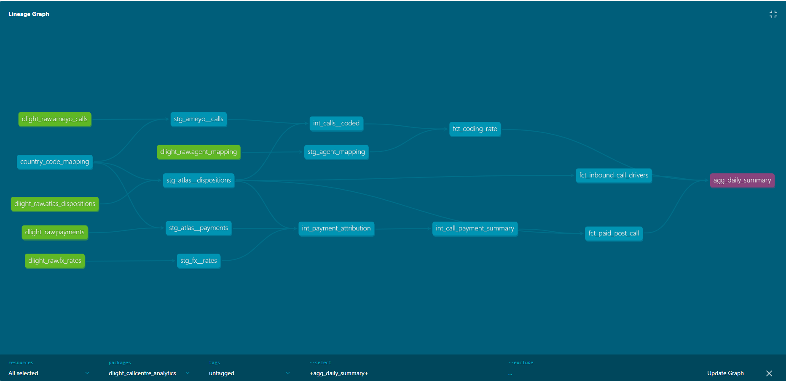
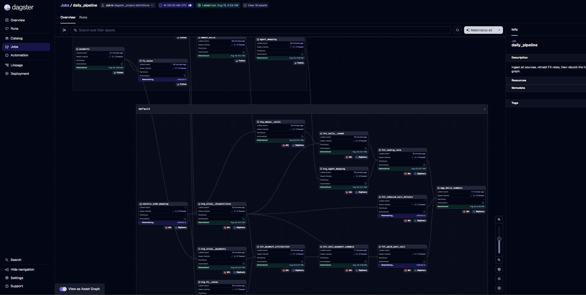
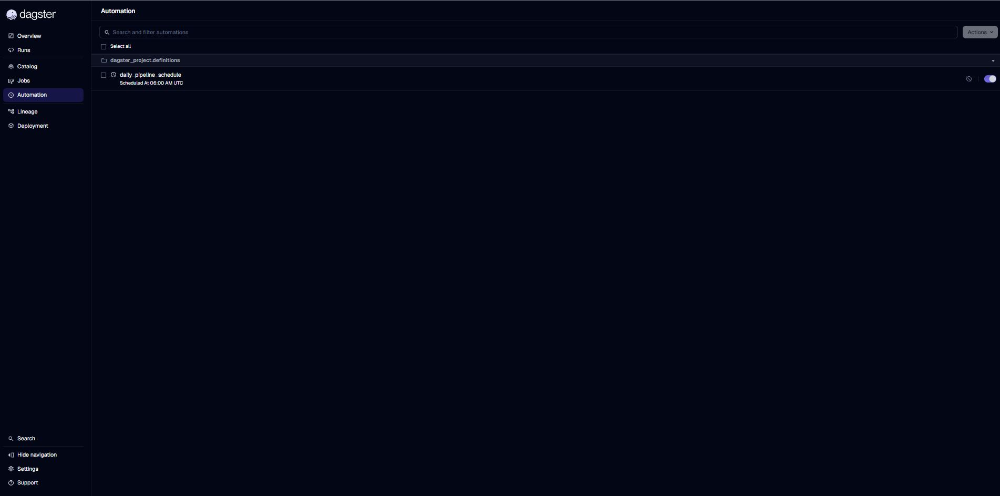
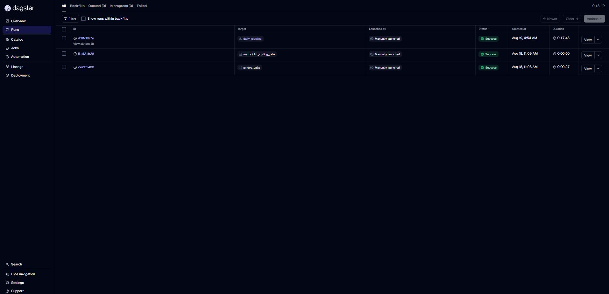
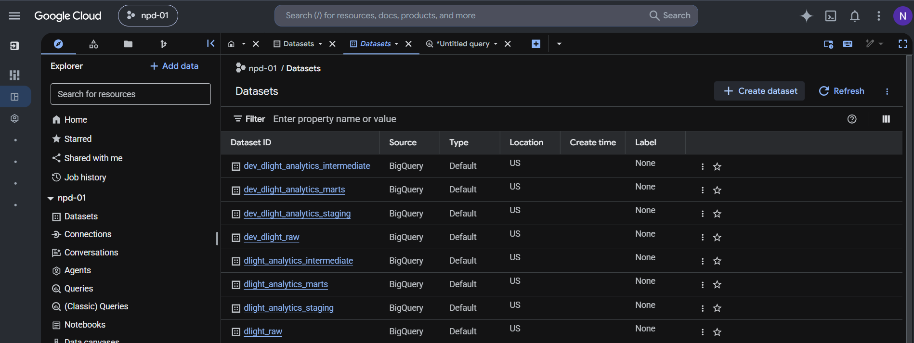
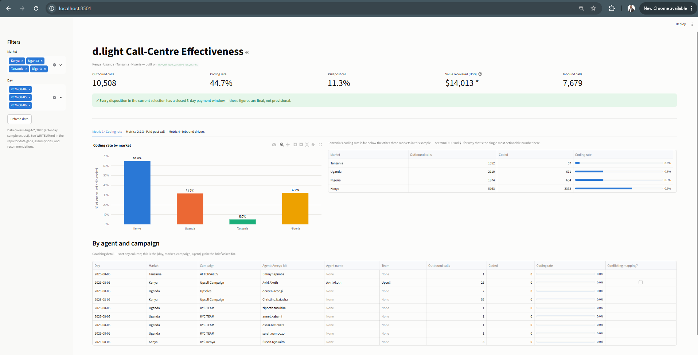
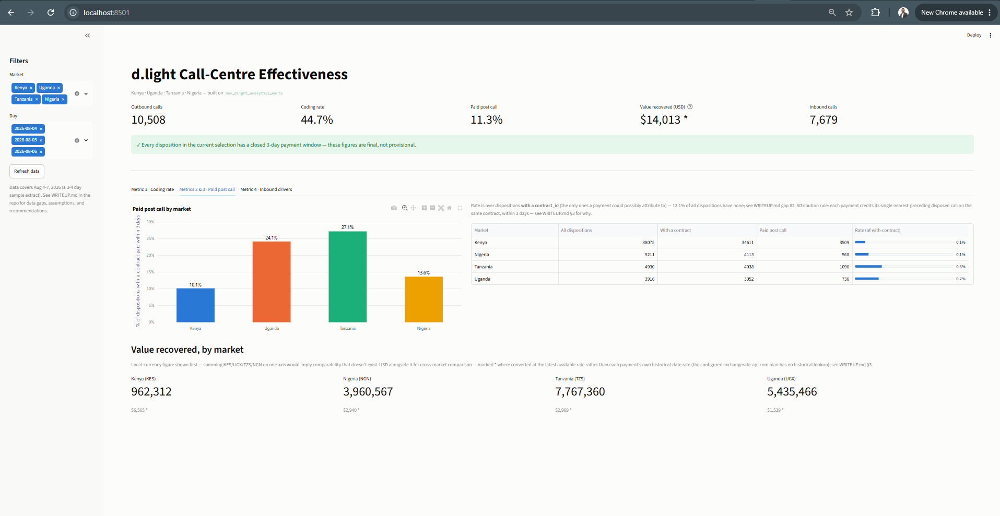
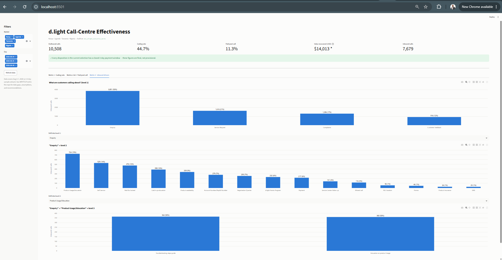

# dlight-callcentre-analytics

This repository contains dbt models, ingestion scripts, and orchestration for the DLight call-centre analytics project.

Quick start (local):

1. Copy credentials into a local `.env` (never commit this file).
2. Install dependencies:
   ```bash
   python -m pip install -r requirements.txt
   ```
3. Run the FX ingestion and dbt locally:
   ```bash
   export PYTHONPATH=.
   python -m dotenv -f .env run -- python ingestion/api/fx/main.py
   cd dbt
   python -m dotenv -f ../.env run -- dbt seed --profiles-dir .
   python -m dotenv -f ../.env run -- dbt run --profiles-dir .
   ```

CI: A GitHub Actions workflow is provided at `.github/workflows/dbt-ci.yml` — populate the repository secrets listed below before enabling the workflow.

Required GitHub secrets for CI:
- `DATABRICKS_HOST`
- `DATABRICKS_HTTP_PATH`
- `DATABRICKS_TOKEN`
- `AZURE_STORAGE_CONNECTION_STRING`
- `EXCHANGE_RATE_API_KEY`
# d.light Call-Centre Effectiveness Pipeline

**A BI Analytics Engineer case study, submitted by Nehemiah Onyinge.**

d.light's call centres in Kenya, Uganda, Tanzania, and Nigeria run on two systems that don't talk to each other: Ameyo (the dialer) and Atlas (the CRM), linked only by an agent manually pasting an ID between them. The business asked four questions about whether those calls actually work. This repository is my answer — a small, production-shaped pipeline that ingests the raw exports, models them in dbt, orchestrates the whole thing with Dagster, and surfaces the results on a dashboard.

The full analysis — the four metrics, the data quality issues I found, the assumptions I made, and my recommendations — is in **[WRITEUP.md](WRITEUP.md)**. This file is just about running the code.

## At a glance

| | |
|---|---|
| **Stack** | Python · Azure ADLS Gen2 · Databricks · dbt · Dagster · Streamlit · GitHub Actions |
| **Ingestion** | Idempotent, from-scratch Python loader — no downloadable service-account key exists anywhere (org policy), so auth is Workload Identity Federation / impersonation throughout |
| **Modelling** | 12 dbt models (staging → intermediate → marts), 33 automated tests, 1 macro |
| **Orchestration** | Dagster asset graph linking raw ingestion to the full dbt DAG, with data-quality checks and a daily schedule |
| **CI/CD** | Every push: Python lint, SQL lint, unit tests, and a full `dbt build` against an isolated Databricks catalog/schema |
| **Result** | 46/46 pipeline checks passing, four metrics answered with real numbers, and one finding (Tanzania's coding rate) worth a same-day conversation with the call-centre team |

## How it's organized

```
data/raw/*.csv ──┐
                 ├──▶ ingestion/load_csv_to_adls.py ──▶ ADLS Gen2 raw blobs  (append-only, byte-for-byte)
exchangerate     │
-api.com    ─────┘──▶ ingestion/api/fx/ (hook → operator) ──▶ Databricks table `fx_rates` (and ADLS raw export)

ADLS raw blobs ──▶ Databricks external tables / staging ──▶ dbt intermediate ──▶ dbt marts ──▶ Streamlit dashboard

Dagster wires all of the above into one graph: raw ingestion → dbt's staging/
intermediate/marts DAG, with asset checks and a daily schedule.
```


| Folder | What's there |
|---|---|
| `ingestion/` | The Python loader and the exchangerate-api.com integration (`api/fx/hook.py`, `fx_operator.py`, `main.py`) |
| `dbt/` | Staging → intermediate → marts models, seeds, tests, and the `.sqlfluff` config |
| `orchestration/` | The Dagster project that wires ingestion and dbt into one schedulable graph |
| `dashboard/` | A Streamlit app on top of the marts |
| `data/raw/` | The four source extracts, committed so the whole thing is reproducible from a clone |
| `WRITEUP.md` | The actual analysis — read this first if you only read one file |

A few design choices worth knowing about before you dig in:

- **Raw is raw.** Every business column lands in ADLS raw blobs (and is surfaced to Databricks external tables) exactly as it appears in the CSV — no casting, no trimming, no deduplication. That choice mattered in practice: it's what let me find and document a set of genuinely conflicting agent records (see WRITEUP.md, gap #4) that an earlier, more "helpful" version of the loader had been silently collapsing.
- **No service-account keys exist.** This GCP org disables key export entirely, so every layer — local dev, Dagster, and CI — authenticates by impersonating a narrowly-scoped service account rather than a downloadable secret.
- **Every number that could be wrong says so.** A payment still inside its 3-day attribution window is flagged `is_window_closed = false`, not silently included as final. A USD figure converted at an estimated exchange rate is flagged `*`, not presented as exact. Nothing here quietly assumes the best case.

## Prerequisites

- Python 3.12+
- Databricks workspace and a SQL warehouse (set `DATABRICKS_HOST`, `DATABRICKS_HTTP_PATH`, and `DATABRICKS_TOKEN` in your `.env`)
- Azure ADLS Gen2 storage account and container (set `AZURE_STORAGE_ACCOUNT`/`AZURE_CONTAINER_NAME` or `AZURE_STORAGE_CONNECTION_STRING`)
- Optional, for Metric 3 in USD: a free key from [exchangerate-api.com](https://www.exchangerate-api.com/)

## Setup

```bash
cp .env.example .env
# edit .env: set GCP_PROJECT_ID, and EXCHANGE_RATE_API_KEY if you have one
pip install -r requirements.txt
```

**Auth**: this repo uses ADLS/Databricks and expects credentials via environment variables or the `azure.identity` + Databricks PAT flow. For local development set the Databricks environment variables in `.env` and authenticate to Azure via the Azure CLI or environment-service principal credentials.

## Running it end to end

```bash
make ingest      # load the 4 CSVs into BigQuery raw.*   (idempotent: re-running is a no-op)
make fx          # fetch/cache missing FX rates          (no-ops gracefully without a key)
make transform   # dbt seed + run + test: staging → intermediate → marts
make test        # pytest on ingestion + dbt test, standalone
```

Or run the whole thing as one orchestrated pipeline (recommended — this is what "runs every morning against yesterday's data" looks like in production):

```bash
make dagster     # opens the Dagster UI at localhost:3000 — click "Materialize all"
```

**What you should see**: raw CSVs uploaded to ADLS and exposed as Databricks external tables, with dbt producing `staging`, `intermediate`, and `marts` models in the target catalog/schema. Both `dbt build` and the Dagster run finish with **46 out of 46 steps passing** — 1 seed, 7 tables, 5 views, 33 tests. (There's also a `prod` copy under the production catalog/schema names — see Environments below for why the naming is split this way.)

### Deleting everything and rebuilding from scratch

```bash
bq rm -r -f --dataset $GCP_PROJECT_ID:dev_dlight_raw
bq rm -r -f --dataset $GCP_PROJECT_ID:dev_dlight_analytics_staging
bq rm -r -f --dataset $GCP_PROJECT_ID:dev_dlight_analytics_intermediate
bq rm -r -f --dataset $GCP_PROJECT_ID:dev_dlight_analytics_marts
make ingest && make fx && make transform
```

Everything regenerates from `data/raw/*.csv` alone — no other manual setup required.

### Handling a new day of data

Drop the next day's 4 CSVs into `data/raw/` (same filenames) and re-run `make ingest`. The loader diffs by whole-file content hash, so it only loads what's actually new — nothing here needs editing to handle it.

## Quality checks

```bash
# Tests
pytest ingestion/tests -v      # 8 unit tests: parsing, rejects, idempotency, FX auth/retry
cd dbt && dbt test              # 33 data tests: uniqueness, not-null, referential integrity,
                                 # plus 2 singular tests protecting Metric 3 from double-counting

# Linting
ruff check ingestion orchestration dashboard   # Python
cd dbt && sqlfluff lint models                  # SQL, via the dbt templater (understands our
                                                 # actual macros and ref()/source() calls)

# Docs (generated, not hand-written)
cd dbt && dbt docs generate && dbt docs serve   # opens at localhost:8080
```



*The dependency chain dbt itself resolved for `agg_daily_summary` — every model's grain and column docs shown here come from the `.yml` files, not just SQL comments.*

## Orchestration (bonus)

```bash
make dagster
```

The asset graph is four raw-ingestion assets plus `fx_rates`, feeding the full dbt staging → intermediate → marts DAG — auto-generated from the dbt manifest and linked to the raw assets so "the transform waits for the load" is an enforced dependency in the graph, not just a convention. A daily schedule (`0 6 * * *`) mirrors the "runs every morning against yesterday's data" requirement — and because every layer is idempotent by construction, a failed run can simply be retried with no cleanup step.

**Monitoring**: two kinds of checks, for two different failure modes. `orchestration/dagster_project/checks.py` has 9 quality checks — row-count sanity and null-rate on each of the 4 raw sources' key columns, plus one checking every payment date has a matching FX rate — that catch a *bad* materialization. `freshness.py` adds checks that catch a *missing* one: every raw source and all 4 consumer-facing marts fail their freshness check if they haven't materialized within an expected window of the daily 6am schedule (verified live — passed with "last update was 5 seconds ago, within the allowed time range of 4 hours..." when I materialized `ameyo_calls`), so a silently broken or skipped run shows up as a red check in the Assets UI instead of a mart that just quietly goes stale. Beyond what's built here: wiring a failed check to Slack or email needs a webhook/SMTP credential this repo doesn't have, so that's a next step rather than something implemented — see WRITEUP.md.

`make dagster` runs `orchestration/run_dagster_dev.sh` rather than calling `dagster dev` directly: on Windows, `dagster dev`'s webserver subprocess occasionally exits immediately with `STATUS_DLL_INIT_FAILED` — a transient OS-level subprocess-spawn hiccup, confirmed non-deterministic (the identical command succeeds on retry with no code or config change). The wrapper polls the real webserver health endpoint and retries up to 3 times if it dies before coming up; if it fails 3 times in a row, that's no longer the known flake and is worth investigating for real.

A second, separate Windows issue turned up under load: the default multiprocess executor spawns a fresh subprocess per step, and since the 4 raw ingestion assets have no interdependencies, they all launch at once — each one re-importing this whole module, which re-triggers dbt's dev-mode manifest preparation (`dbt deps` + `dbt parse`) as a side effect. Concurrent subprocesses raced on the same `dbt_packages/` directory and failed with no visible reason (Windows has compute-log capture disabled here, so the real exception only showed up in the daemon's own console log, not the UI). Fixed by pinning `daily_pipeline_job` to a serial executor (`max_concurrent=1`, in `definitions.py`) — this pipeline's data volume doesn't need real per-step parallelism, so trading ~3 minutes for ~18 is the right call over working around dagster-dbt's dev-mode preparation.



*The full asset graph — 4 raw sources + `fx_rates` feeding the dbt-generated staging → intermediate → marts DAG — alongside the job header confirming the latest run succeeded and the daily schedule is on. (A second copy with the browser URL bar visible, `asset-graph-with-url.png`, is in the same folder for anyone who wants proof this is a live local instance rather than a staged image.)*



*`daily_pipeline_schedule`, toggled on, `06:00 AM UTC`.*



*A full pipeline run, post-fix: all 17 steps succeeded in 0:17:43.*

## CI/CD

`.github/workflows/ci.yml` is two jobs, not one:

-- **`test`** — every push, every PR, any branch. Python lint (ruff) and the ingestion unit tests only; no Databricks/dbt involved, so it never touches remote state and needs no cloud auth at all.
- **`deploy_prod`** — only on a push to `main`, and only once `test` has passed (`needs: test`, `if: github.ref == 'refs/heads/main'`). This is where the SQL lint (sqlfluff), ingestion, FX refresh, and a full `dbt build` actually run, all against prod.

Auth uses Workload Identity Federation — no service-account key is stored in GitHub, consistent with the key-less design used everywhere else in this project.

## Environments

Two dbt targets, two dataset groups, same GCP project — never sharing tables:

| Target | Datasets | Who writes to it | Rebuilt |
|---|---|---|---|
| `dev` (default) | `dev_dlight_raw`, `dev_dlight_analytics_{staging,intermediate,marts}` | Whoever's iterating locally — model, run `dbt build`/`dbt run`, and validate here before pushing | On demand — see "Deleting everything and rebuilding from scratch" above |
| `prod` | `dlight_raw`, `dlight_analytics_{staging,intermediate,marts}` | Only GitHub Actions' `deploy_prod` job | Every push to `main`, once `test` passes |



*Both environments in one Explorer view — `dev_dlight_*` and the plain `dlight_*` side by side, nothing else in the project mixed in.*

The plain, unmarked name is **prod**, not dev — the opposite of how this looked earlier on. That's deliberate: the ready-for-use dataset a BI tool or analyst would actually query should have the name with no caveat attached, and the one still being iterated on should carry the label. The corollary matters more than the naming itself: every default in this repo (`ingestion/common.py`'s `get_raw_dataset()`/`get_analytics_dataset()`, `dbt/profiles.yml`'s `dev` target) falls back to the `dev_` prefixed name when an env var is simply unset — so forgetting to configure something lands you in dev, never silently in prod. `deploy_prod` is the one and only place that explicitly overrides both to reach the plain name.

`prod` is deliberately CI/CD-only beyond that: `deploy_prod` is gated with `if: github.ref == 'refs/heads/main'` and `needs: test`, so it only runs after lint and unit tests are green, and nothing in this repo or its docs tells a human to point a local `dbt build` at it. That's what makes "prod is never touched from a laptop" a fact about how the pipeline runs rather than a comment asking nicely — no separate `DBT_TARGET=prod` workflow exists for a person to accidentally reach for.

The trade-off, stated plainly rather than glossed over: a model that fails to build is only caught at merge time (inside `deploy_prod`), not on the PR itself, since there's no third copy of the data for a PR-time job to validate against. That's why validating locally against `dev` before pushing still matters — it's the pre-merge check this design relies on instead of a CI-only sandbox.

One more honest limit: `dev` and `prod` currently authenticate as the same service account (`dlight-case-study@npd-01.iam.gserviceaccount.com`), scoped to this one case study. A real production rollout would give `prod` its own, more narrowly-scoped service account and grant analysts read-only IAM on just the prod marts dataset — enforcing the boundary at the IAM layer, not only the workflow layer. That needs permissions (creating service accounts, setting IAM policy) beyond what's granted for this exercise, so it's a recommendation rather than something built here.

## Dashboard (bonus)

```bash
make dashboard   # opens at localhost:8501
```

A Streamlit app reading only from the marts. Sidebar filters for market and day; a KPI row that turns into a visible warning the moment any payment is still inside its 3-day attribution window; one tab per metric, including the full agent/campaign coaching table for Metric 1 and a level-1-to-3 drill-down for Metric 4. Every market keeps the same color on every chart, in every tab.



*Coding rate by market, plus the full agent/campaign coaching table the team asked for.*



*Paid-post-call rate by market, and value recovered per market in local currency — every USD figure carries the `*` estimated-FX marker.*



*The level-1 → level-2 → level-3 drill-down, mid-drill: Enquiry → Product Usage/Education.*
